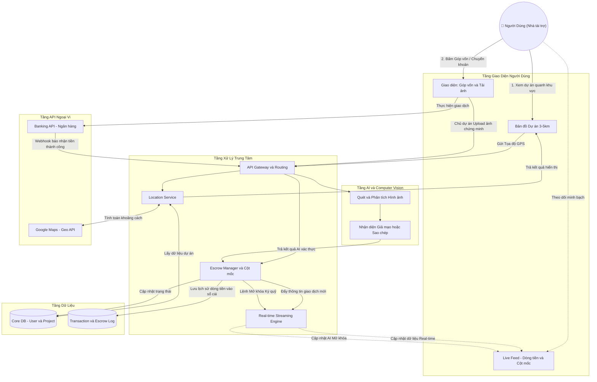

```mermaid
graph TD
    %% Chủ thể (Actor)
    User(("👤 Người Dùng (Nhà tài trợ)"))

    %% Khối Người dùng & Giao diện
    subgraph UILayer [Tầng Giao Diện Người Dùng]
        MapUI["Bản đồ Dự án 3-5km"]
        FeedUI["Live Feed - Dòng tiền và Cột mốc"]
        ActionUI["Giao diện: Góp vốn và Tải ảnh"]
    end

    %% Khối Xử lý Trung tâm
    subgraph CoreBackend [Tầng Xử Lý Trung Tâm]
        API_Gateway["API Gateway và Routing"]
        Location_Svc["Location Service"]
        Escrow_Mgr["Escrow Manager và Cột mốc"]
        Stream_Engine["Real-time Streaming Engine"]
    end

    %% Khối AI & Dữ liệu
    subgraph AILayer [Tầng AI và Computer Vision]
        CV_Model["Quét và Phân tích Hình ảnh"]
        Fraud_Detection["Nhận diện Giả mạo hoặc Sao chép"]
    end

    %% Khối Cơ sở dữ liệu
    subgraph Database [Tầng Dữ Liệu]
        DB_Main[("Core DB - User và Project")]
        DB_Ledger[("Transaction và Escrow Log")]
    end

    %% Khối Ngoại vi
    subgraph External [Tầng API Ngoại Vi]
        Bank_API["Banking API - Ngân hàng"]
        Map_API["Google Maps - Geo API"]
    end

    %% --- ĐỊNH NGHĨA LUỒNG TƯƠNG TÁC CỦA NGƯỜI DÙNG ---
    User -->|1. Xem dự án quanh khu vực| MapUI
    User -->|2. Bấm Góp vốn / Chuyển khoản| ActionUI
    User -.->|Theo dõi minh bạch| FeedUI

    %% --- ĐỊNH NGHĨA LUỒNG DỮ LIỆU BÊN TRONG ---

    MapUI -->|Gửi Tọa độ GPS| API_Gateway
    API_Gateway --> Location_Svc
    Location_Svc <-->|Tính toán khoảng cách| Map_API
    Location_Svc <-->|Lấy dữ liệu dự án| DB_Main
    Location_Svc -->|Trả kết quả hiển thị| MapUI

    ActionUI -->|Thực hiện giao dịch| Bank_API
    Bank_API -->|Webhook báo nhận tiền thành công| API_Gateway
    API_Gateway --> Escrow_Mgr
    Escrow_Mgr -->|Lưu lịch sử dòng tiền vào sổ cái| DB_Ledger
    Escrow_Mgr -->|Đẩy thông tin giao dịch mới| Stream_Engine
    Stream_Engine -.->|Cập nhật dữ liệu Real-time| FeedUI

    ActionUI -->|Chủ dự án Upload ảnh chứng minh| API_Gateway
    API_Gateway --> CV_Model
    CV_Model --> Fraud_Detection
    Fraud_Detection -->|Trả kết quả AI xác thực| Escrow_Mgr
    Escrow_Mgr -->|Cập nhật trạng thái| DB_Main
    Escrow_Mgr -->|Lệnh Mở khóa Ký quỹ| Stream_Engine
    Stream_Engine -.->|Cập nhật AI Mở khóa| FeedUI
```
